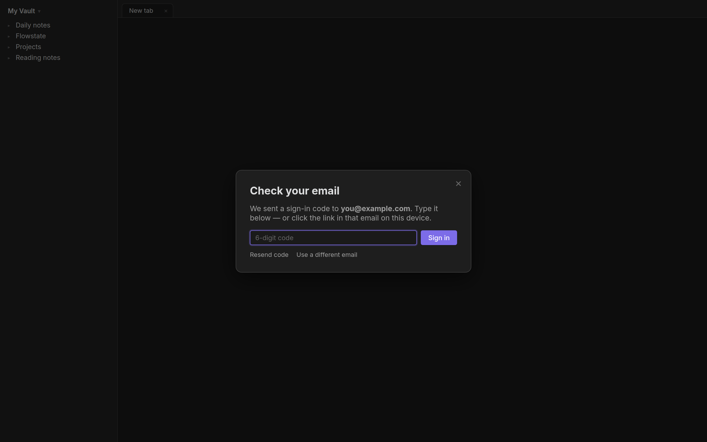
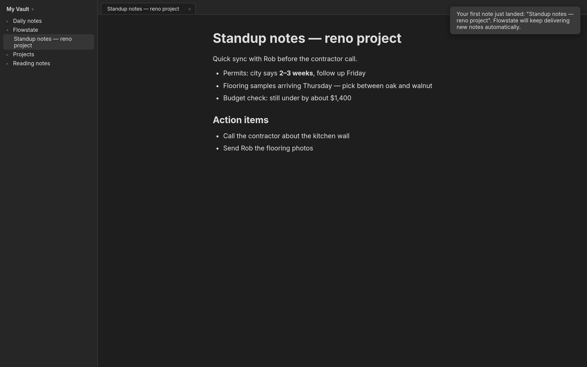

# Screenshots — onboarding & capture PR

All rendered from the real plugin code in an Obsidian-styled harness.
(This folder exists for PR review; safe to delete after merge.)

## Sign-up funnel

**Onboarding modal (first load, signed out)**

**Onboarding — code entry step**

**Settings — signed out**

**Settings — code entry**

## First-note a-ha

**Sample note offer (after first sign-in)**

**Sample note in the vault — transcription + handwritten PDF**

**Welcome preview (skip path — ephemeral view, nothing written)**

**First delivery notice**

## Capture

**Settings — signed in, Capture section**

**Get-the-app modal (QR + web app link)**

**Upload modal — files, flow, instructions, credit estimate**

